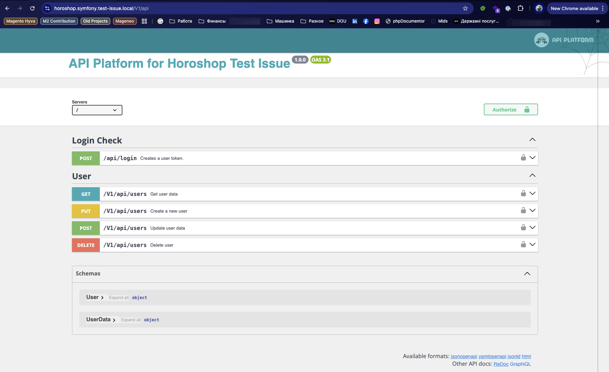

THE TEST ISSUE FOR HOROSHOP
===========================

This project has implementation of the test issue requested by HR by [this link](https://horoshop.notion.site/API-users-symfony-c57198f3b960411ebee76268f57bf7e6).
This project implemented with custom docker environment uses Nginx 1.24, PHP-FPM 8.3, and MySQL (MariaDB 10.6).
The database dump can be found in the dump file attached in the project.

## Documentation

1. [Install](#installation)
1. [Basic usage](#basic-usage)
    1. [Get user data](#get-user-data)
    1. [Create a new user](#create-a-new-user)
    1. [Update user data](#update-user-data)
    1. [Delete user](#delete-user)
1. [Security](#security)
    1. [API Login](#security)

## Installation
Prepare the local environment with necessary environments ([Nginx], PHP-FPM, MySQL).

Import the provided database into MySQL.

Fix provided .env file to connect to the database according to your credentials.

Run composer install to install composer dependencies that required for project

## Basic usage
Go to the `/v1/api` to see the swagger feature of the implemented API


### Get user data

To get user data you can use this GET request for `/v1/api/users` endpoint.

This request require one query param `id` that should have number the format.

Also, this request requires bearer token to get user data:

  - admin users can get data of any user of the system
  - user can get only data of its user

### Create a new user

To create a new user you can use this PUT request for `/v1/api/users` endpoint.

This request require the request body provided on the example below:

```json
{
   "login": "john_doe",
   "phone": "1234567",
   "pass": "!uhb567?"
}
```

This request does not require authorisation and available for any user.

### Update user data

To update user data you can use this POST request for `/v1/api/users` endpoint.

This request require the request body provided on the example below:

```json
{
   "login": "john_doe",
   "phone": "1234567",
   "pass": "!uhb567?",
   "id": 123
}
```

Also, this request requires bearer token to get user data:

  - admin users can update data of any user of the system
  - user can update only data of its user

### Delete user

To delete user from the system you can use this DELETE request for `/v1/api/users` endpoint.

This request require one query param `id` that should have number the format.

Also, this request requires bearer token to get user data:

- admin users can delete any user of the system
- user unable to delete user at all

## Security
To use requests of this API (all requests instead of `"Create a new user"`) you need to be authorised as admin user or user
existing in the system.

To work with the API, you need to authorise with your credentials via `POST:/api/login` endpoint and request body provided in the next example:

```json
{
   "login": "YOUR-LOGIN",
   "pass": "YOUR-PASSWORD"
}
```

You'll get the access token (Bearer). Please copy it and paste to your authorisation header.
